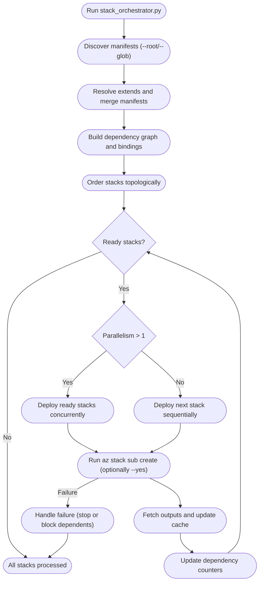

# Deployment Stacks Orchestrator

Lightweight tooling for orchestrating Azure Bicep Deployment Stacks with a Terragrunt-style inspired framework.

## Quick start

### Prerequisites

- Python 3.10+
- Azure CLI (`az`) authenticated to the target subscription

Install the orchestrator dependency once:

```powershell
pip install -r requirements.txt
```

### Common commands

```powershell
# Preview every stack in the repository root
python tools/stack_orchestrator.py --root "." --dry-run

# Deploy the full prod environment (global + every region)
python tools/stack_orchestrator.py --root "environments/prod" --parallelism 4

# Deploy only the prod/uksouth app overlays
python tools/stack_orchestrator.py --root "environments/prod/uksouth/app" --parallelism 4

# Target a single stack (dependencies included automatically)
python tools/stack_orchestrator.py --root "." --stacks az-stack-shared

# Fast redeploy without replaying dependencies
python tools/stack_orchestrator.py --root "." --stacks az-stack-shared --skip-dependencies
```

Useful switches:

- `--dry-run` prints the planned `az stack sub create` commands without running them.
- `--echo` mirrors each Azure CLI command (stack-by-stack) when you want to see the full invocation.
- `--parallelism <n>` lets independent stacks deploy concurrently.
- `--yes` forwards non-interactive confirmation to the Azure CLI.
- `-o/--output <format>` forwards the Azure CLI output mode (set to `none` when you want a quiet demo).
- `STACK_ORCHESTRATOR_DEPENDENCIES=skip` can flip the default dependency behaviour for one-off patching.

## Orchestrator flow



## Stack hierarchy

Each directory maps cleanly to Azure landing zones or app overlays:

- `bicep/<landing-zone>/` &mdash; reusable landing zones (for example `shared`, `app`) packaged as Bicep modules with their default and region-specific `.bicepparam` files.
- `bicep/<landing-zone>/*.manifest.yaml` &mdash; base manifests that pin template paths, baseline parameters, and exports while staying neutral about environment-specific dependencies.
- `environments/{environment}/{region}/{app}/` &mdash; lightweight overlays representing the deployed app in that region. Each overlay extends the landing zone baseline, wires up the dependencies that apply to that environment, and tweaks only what varies (names, locations, parameter packs, CLI flags).

At the top level you get a clean split between reusable building blocks and environment overlays:

```text
./
  bicep/          # Landing zones + shared manifests
  environments/   # Env/region/app overlays that extend the landing zones
```

### Adding a new region overlay

1. Duplicate the relevant parameter files under `bicep/<landing-zone>/` (for example `main.bicepparam`, `main.dev.bicepparam`) and rename resources that must stay unique.
1. Create overlays in `environments/{environment}/{region}/` that `extends` the base manifest alongside any environment-specific tweaks (name, location, parameter pack, CLI flags, dependency list).
1. Dry run the new scope to verify dependencies and bindings:

   ```powershell
   python tools/stack_orchestrator.py --root "environments/{environment}/{region}" --dry-run
   ```

1. When ready, point `--root` at the entire environment to include the regional overlays alongside global stacks.

Dependency order is inferred from the merged manifest, so the overlays you create control which upstream stacks are needed for that environment.

## Manifest capabilities

All manifests share the same contract (enforced via `schema/manifest.schema.json`):

- `stack.template` chooses the Bicep file and optional parameter pack.
- `dependencies[]` list upstream stacks and which outputs to consume.
- `exports` (optional) publish values for downstream stacks when you can’t or don’t want to read outputs directly from the dependency.
- `parameterBindings` map template parameters to dependency outputs (handy when skipping dependencies or crossing subscriptions).
- `stack.extraAzArgs` appends custom flags (tags, template-spec IDs, etc.).
- `extends` performs a deep merge, so overlays can override only the properties that change per environment.

Refer to `schema/example.manifest.yaml` for a full, realistic sample manifest that exercises every field described above.

> **Note**
> When deploying stacks that live in different subscriptions, add `--subscription {subscription-id}` to `stack.extraAzArgs` (as shown in the example manifest) so the orchestrator runs each Azure CLI invocation against the correct subscription.

## Why Split Into Orchestrated Micro Stacks?

- **Micro deployment pattern** – splitting landing zones out of monolithic resource groups into micro stacks enables granular RBAC so teams manage only what they need while staying under the 4 MB ARM template limit and avoiding large-template timeouts.
- **Dependency mapping** – YAML manifests declare stack dependencies; the orchestrator resolves them and prints a dependency map with dry-run output, similar to a what-if view for stack relationships.
- **Parallelism** – independent stacks can deploy concurrently with the `--parallelism` switch, whether you target a single stack, an app, or an entire environment.
- **Targeted rollouts** – running the orchestrator against production, a region, or specific stacks (for example `--stacks stack1 stack2`) discovers the manifests in scope, orders them correctly, and deploys as the dependency map dictates.
- **Isolation and downstream output chaining** – with upstream stacks split into micro deployments, teams can amend only the components they own (such as monitoring) without touching unrelated resources, and downstream dependencies automatically receive updated values from deployment stack outputs.

### Optional exports in practice

Most stacks can skip the `exports` block because Bicep modules usually read dependency data via `resource ... existing` (the app stack already pulls the monitoring connection string that way). Add exports only when you need the orchestrator to forward values as parameters&mdash;for example, when a consumer stack can’t inspect the dependency directly. This mirrors Terragrunt `dependency` blocks that hand module outputs to other deployments without wiring them up inside Terraform code.

```yaml
dependencies:
  - name: dns
    stackName: az-stack-dns

exports:
  publicZoneName: outDnsZoneName

parameterBindings:
  parDnsZoneName: dns.publicZoneName
```

In that scenario the dependent template stays decoupled from the DNS stack; the orchestrator resolves the export and passes it along even during `--skip-dependencies` runs.

> Azure deployment stacks currently don’t support secure outputs between stacks. Use Key Vault references or managed identities if you need to share secrets.

### Mapping dependency outputs (when you need to)

The `dependencies[].outputs` block is optional and now trimmed from the default manifests. Reintroduce it only when:

- You plan to use `parameterBindings` so the orchestrator can forward a dependency output without replaying that stack.
- You want to document a cross-stack contract that isn’t obvious from the templates (for example when skipping dependencies or working across subscriptions).

```yaml
dependencies:
  - name: monitoring
    stackName: az-stack-monitoring
    outputs:
      connectionString: applicationInsightsConnectionString

parameterBindings:
  parAppInsightsConnectionString: monitoring.connectionString
```

Leave the block out for everyday scenarios; the orchestrator will still infer deployment order from the dependency list.

Add the schema directive to take advantage of validation and IntelliSense:

```yaml
# yaml-language-server: $schema=../schema/manifest.schema.json
```

Adjust the relative path based on where the manifest lives.

## Tips

- Point `--root` at any folder to scope discovery (e.g. `environments/prod/uksouth/app`).
- Every run prints a quick dependency map and execution order for the stacks slated to deploy.
- Use environment overlays to introduce per-region tweaks without touching the reusable stack definitions.
- Global resources (Front Door, DNS, etc.) live under `environments/{environment}/global/` so they deploy once per environment.
- For CI, pair `--dry-run` with `--yes` and `--parallelism` for fast feedback.
